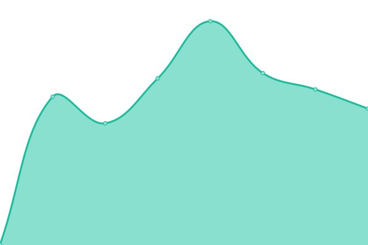

# [📈 Live Status](https://vajradog.github.io/chitstat): <!--live status--> **🟧 Partial outage**

This repository contains the open-source uptime monitor and status page for [Thupten N Chakrishar](http://www.chakrishar.com), powered by [Upptime](https://github.com/upptime/upptime).

With [Upptime](https://upptime.js.org), you can get your own unlimited and free uptime monitor and status page, powered entirely by a GitHub repository. We use [Issues](https://github.com/vajradog/chitstat/issues) as incident reports, [Actions](https://github.com/vajradog/chitstat/actions) as uptime monitors, and [Pages](https://vajradog.github.io/chitstat) for the status page.

<!--start: status pages-->
<!-- This summary is generated by Upptime (https://github.com/upptime/upptime) -->
<!-- Do not edit this manually, your changes will be overwritten -->
<!-- prettier-ignore -->
| URL | Status | History | Response Time | Uptime |
| --- | ------ | ------- | ------------- | ------ |
|  [Chitta Website](https://chitta.app) | 🟩 Up | [chitta-website.yml](https://github.com/vajradog/chitstat/commits/HEAD/history/chitta-website.yml) | 

 257ms
     
 | 

<a href="https://vajradog.github.io/chitstat/history/chitta-website">100.00%</a>
    

|  [Chitta API - Health Check](https://chitta.app/api/health) | 🟥 Down | [chitta-api-health-check.yml](https://github.com/vajradog/chitstat/commits/HEAD/history/chitta-api-health-check.yml) | 

 419ms
     
 | 

<a href="https://vajradog.github.io/chitstat/history/chitta-api-health-check">97.98%</a>
    

<!--end: status pages-->

[**Visit our status website →**](https://vajradog.github.io/chitstat)

## 📄 License

- Powered by: [Upptime](https://github.com/upptime/upptime)
- Code: [MIT](./LICENSE) © [Anand Chowdhary](https://anandchowdhary.com), supported by [Pabio](https://pabio.com)
- Data in the `./history` directory: [Open Database License](https://opendatacommons.org/licenses/odbl/1-0/)
